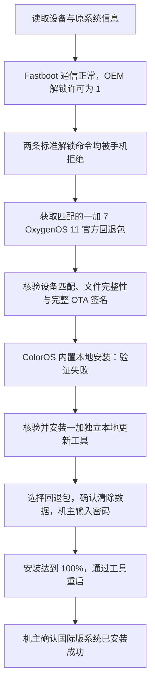

# OnePlus 7：ColorOS → OxygenOS 国际版实测记录

一台 **一加 7 GM1900 / ColorOS 12.1（Android 12，GM1900_11_H.40）**，在标准 bootloader 解锁命令被手机拒绝后，通过 **一加独立本地更新工具 + 官方签名的 OxygenOS 11 回退包**完成了国际版转换。

> 本案例没有成功解锁 bootloader，没有使用 9008，也没有修改固件或关闭签名验证。换系统成功由机主开机后确认；重启后的具体版本号和锁定状态没有再通过电脑读取。

记录日期：2026-09-16。安装包目标为 **OxygenOS 11.0.5.1 / Android 11**，不是最新系统。回退会清空手机数据；这是一次已获机主同意的数据清除操作记录。实测范围仅限下表中的设备与原系统组合。

## 实测结果

| 项目 | 实际观察 |
| --- | --- |
| 手机 | OnePlus 7，GM1900，`OnePlus7`，项目 18857 |
| 原系统 | ColorOS 12.1 / Android 12 / `GM1900_11_H.40` |
| 初始 bootloader | 锁定；`get_unlock_ability: 1` |
| 标准解锁 | 两条命令均返回 `Device cannot be unlocked for technical reason.` |
| ColorOS 自带本地安装 | 显示“验证失败”，没有开始安装 |
| 独立一加本地更新工具 | 接受回退包；安装进度达到 100%，显示安装完成 |
| 最终结果 | 机主确认已进入国际版系统，随后断开电脑 |
| 未复核的内容 | 重启后的精确版本、bootloader 状态、通话及各应用功能 |

## 成功路径



最初的计划是先回退 Android 11，再尝试解锁。回退包本身已经是国际版，所以完成回退就满足了机主的实际目标，后续没有再执行解锁命令。

## 阅读顺序

1. [完整操作过程](docs/procedure.md)：环境、诊断命令、失败分支和成功安装步骤。
2. [文件来源与验证](docs/verification.md)：官方资源、社区 APK 副本、签名与校验值。
3. [证据及适用范围](docs/evidence.md)：哪些是原始输出、哪些是转录，哪些结论仍未验证。
4. [脱敏数据](data/)：设备构建信息、Fastboot 输出、校验报告、OTA 元数据与公开签名证书。

## 文件校验

固件和 APK 不随仓库分发。获取地址、精确大小、哈希及签名证书指纹见 [资源清单](data/artifacts.json)。固件约 2.58 GB；ADB / Fastboot 使用 Google 官方 Platform Tools。

下载后使用 **PowerShell 7** 在电脑上验证文件；以下脚本只读取本地文件，不连接或操作手机：

```powershell
pwsh -File scripts/Verify-Artifacts.ps1 `
  -FirmwarePath 'D:\Downloads\OnePlus7Oxygen_14.P.41_OTA_0410_all_2112101753_downgrade_da90e698650240ff.zip' `
  -UpdaterApkPath 'D:\Downloads\OPLocalUpdate_For_Android12.apk'

pwsh -File scripts/Verify-OtaSignature.ps1 `
  -FirmwarePath 'D:\Downloads\OnePlus7Oxygen_14.P.41_OTA_0410_all_2112101753_downgrade_da90e698650240ff.zip'
```

第一个脚本检查两个文件的大小与 SHA256。第二个脚本验证本案例固件的 Android 整包 OTA 签名及固定的 OnePlus 公钥；它针对本案例签名格式编写，不是通用 Android 包验证器。APK 完整签名检查的原始结果另保存在仓库中，不能把 SHA256 检查单独称为重新执行了 APK 签名验证。

## 关键资源

- [Oxygen Updater 维护者的回退资源列表](https://oxygenupdater.com/article/352/)：一加 7 Global/India 回退包及独立更新工具入口。
- [Android 官方 bootloader 文档](https://source.android.com/docs/core/architecture/bootloader/locking_unlocking)。
- [Android 官方 OTA 签名说明](https://source.android.com/docs/core/ota/sign_builds)。
- [Google Platform Tools](https://developer.android.com/tools/releases/platform-tools)。

此仓库是单次实测的整理记录，与 OnePlus / OPPO 无隶属关系。下载材料及第三方工具保留各自权利归属。序列号、IMEI、账户信息、电脑个人路径、调试私钥和完整手机界面转储没有纳入发布内容。

## English overview

This repository documents one OnePlus 7 GM1900 running ColorOS 12.1 / Android 12 (`GM1900_11_H.40`). Both standard bootloader unlock commands were rejected. A signed OxygenOS 11 rollback package was accepted by the standalone OnePlus local updater after the built-in ColorOS updater had rejected it. Installation reached 100%, and the owner confirmed successful use of the international system after reboot.

No successful bootloader unlock, EDL/9008 flash, modified firmware, or disabled signature verification is claimed. The package targets OxygenOS 11.0.5.1; the post-reboot build and lock state were not independently read back. This is a single-device case report, not a guarantee for other models or firmware versions.
